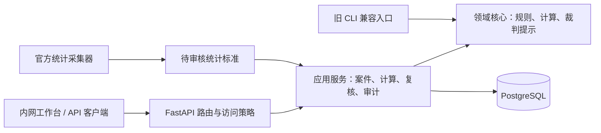

# 架构与安全说明

## 架构选择

项目采用模块化单体，而不是微服务。对单一律所的人员规模和维护能力而言，这能保留清晰领域边界，同时避免服务发现、分布式事务、消息一致性和多套部署链路带来的长期成本。

边界约定：

- `domain` 不访问数据库、网络或 Web 框架，计算可独立测试。
- `application` 负责规则解析、统计标准装配、快照、复核任务和审计事务。
- `web` 负责认证、角色与案件范围策略，不复制计算逻辑。
- `infrastructure` 负责数据库、配置、迁移和采集结果导入。
- 根目录旧脚本只作为兼容入口；新的计算规则只在包内维护。

## 安全模型

系统假设使用者是律所员工，但不假设内网天然可信：

- 会话令牌只存哈希，Cookie 为 HttpOnly、SameSite=Strict；生产环境强制 Secure 和 HTTPS。
- 不存在账号也执行等成本密码校验；登录失败有时间窗限流和内存上限。
- 管理员看全部案件，律师和助理按案件成员关系过滤；相同策略复用于案件、复核和审计接口。
- 高风险写操作写入审计日志；密码和会话令牌不进入审计详情。
- HTML 工作台只用 `textContent` 构造外部数据，避免存储型 XSS。
- 采集器按官方域名逐跳限制网络访问，并限制响应体、PDF 页数及电子表格公式注入。
- 生产启动拒绝演示标准、自动建表、通配主机、不安全 Cookie 和 HTTP 公共来源。

## 生产前置条件

以下条件不由应用代码自动完成，是录入真实案件数据前的上线门槛：

1. 应用主机和 PostgreSQL 数据卷启用 BitLocker、LUKS 或等效的静态加密。
2. 备份使用独立加密密钥，并至少完成一次恢复演练；定期检查备份可读性。
3. HTTPS 证书由律所受控 CA 或可信 CA 签发；反向代理与应用位于同一受控主机或隔离网络。
4. PostgreSQL 不暴露到办公网；应用使用非超级用户账号，密码只保存在受限环境配置中。
5. 初始化完成后清除 `BOOTSTRAP_TOKEN`；关闭接口文档；定期复核在职账号和案件成员。
6. 日志、数据库备份和采集导出文件设置最小访问权限及明确保留期限。

本版本不做应用层字段加密。原因是单所系统中，能解密业务字段的应用与数据库位于同一信任边界，字段加密无法替代主机隔离和备份加密，却会引入轮换、检索和灾备复杂度。如果数据库将迁移到第三方托管、运维人员不在同一信任边界，或需要对特定字段实施密钥分权，应在迁移前重新设计信封加密与密钥托管，不能直接沿用当前方案。

## 扩展边界

适合在现有单体内继续增加：保险责任分层、更多历史规则、案件状态流转、模板化文书和内部报表。

需要先重新设计再实施：多律所租户、客户门户、互联网公开访问、外部对象存储、第三方身份登录、跨地区灾备或独立移动端。这些变化会改变信任边界、数据隔离和运维模型，不应只靠增加几个接口完成。

## 维护原则

- 法律规则版本和算法版本分别记录，规则变更必须增加边界测试，不覆盖历史快照。
- 统计标准保留来源、哈希、审核人和审核时间；采集成功不等于可用于正式计算。
- 数据库结构只通过 Alembic 迁移；生产环境禁止自动建表。
- 删除功能默认不提供。将来如需删除案件，应先定义归档、审计、备份和法律保留策略。
